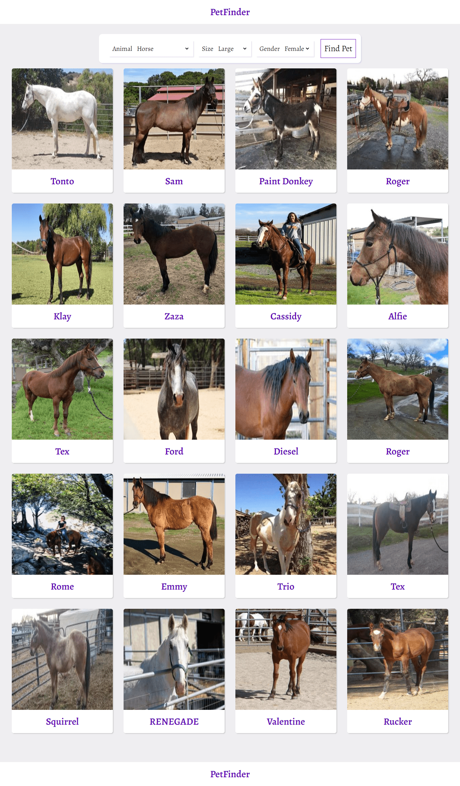
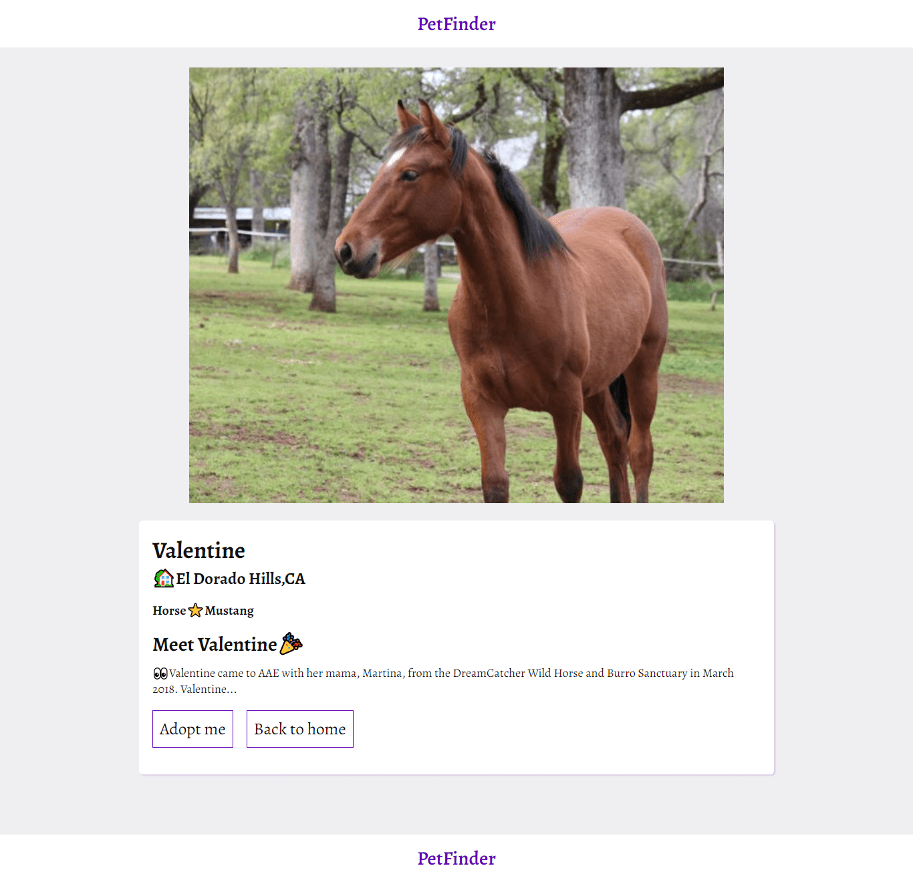

# Pets Catalogue

### Search page

### Details page

# About the project

This project was built as a React & Redux Capstone project at Microverse. It is based on the idea of a "Catalogue of Recipes" which is a single-page application with React and Redux.
It shows a browsable list of pets that users can filter and access to the details of each pet. Every page, the main page, and pages for each item have a unique route within the Single Page Application, SPA.

I deployed this app to Netlify, so it’s accessible online. The data is retrieved from the PetFinder API. With this API, this app fetches the list data of pets based on the user’s selections. And the retrieved data is stored in the Redux store.
Also with this app, you can see pets and through their details, if you want you can adopt one of them.

This web app has 2 types of pages:

- On the first page you can filter the pet's data with given parameters. You can filter pets with their species, size and gender.
- Second page is the details page which is responsible for the details of pets that you want to see.

## Live Demo

- [Live](https://pets-finder.netlify.app/)

## Introduction Videos

- [Video-1](https://www.loom.com/share/79a7ba8fe01747c98cc104d82dfd8ca7)
- [Video-2](https://www.loom.com/share/a160ad1198e342138cbefb2075cd49f5)
- [Video-3](https://www.loom.com/share/9f9a38632f934aefa4f1a4d35565d54d)

## Built with

- JavaScript
- React
- JSX
- SCSS
- Node
- Redux
- API

## Getting Started

- Clone the repo `git@github.com:Murodjon000/Pets.git`
- cd `into` the project
- Run `git pull origin app`
- Run `yarn install` or `npm install` to install dependencies
- On the terminal run `npm run start` open up the live server
- To run tests write `npm run test` on the terminal

## Author

👤 **Murodjon Tursunpulatov**

- Github: [@murodjon000](https://github.com/murodjon000)
- Twitter: [@MurodjonTursun5](https://twitter.com/MurodjonTursun5)
- Linkedin: [@Murodjon Tursunpulatov](https://www.linkedin.com/in/murodjon-tursunpulatov-5189481b3/)

## 🤝 Contributing

Contributions, issues and feature requests are welcome!

Feel free to check the [issues page](issues/).

## Show your support

Give a ⭐️ if you like this project!

## 📝 License

MIT License
